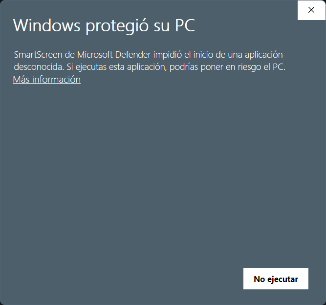
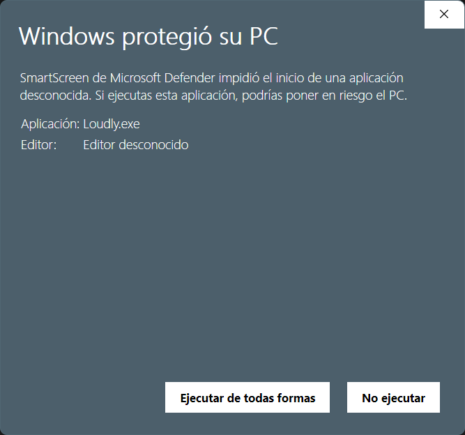
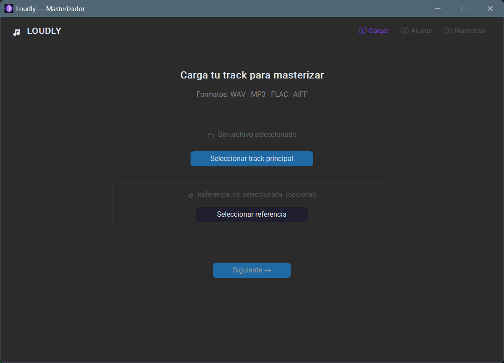
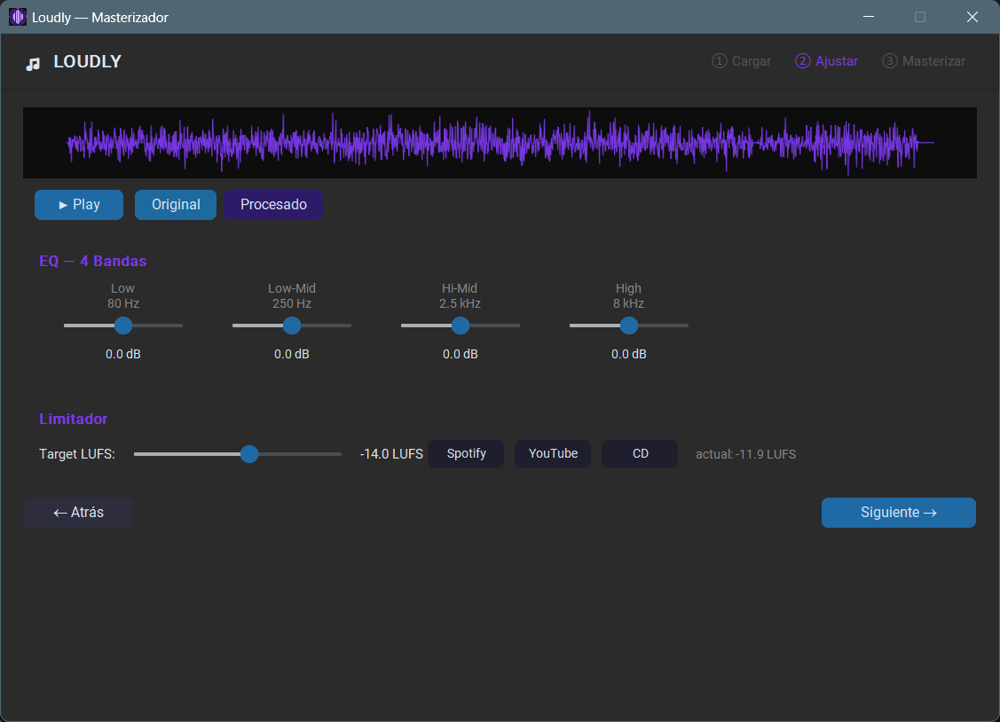
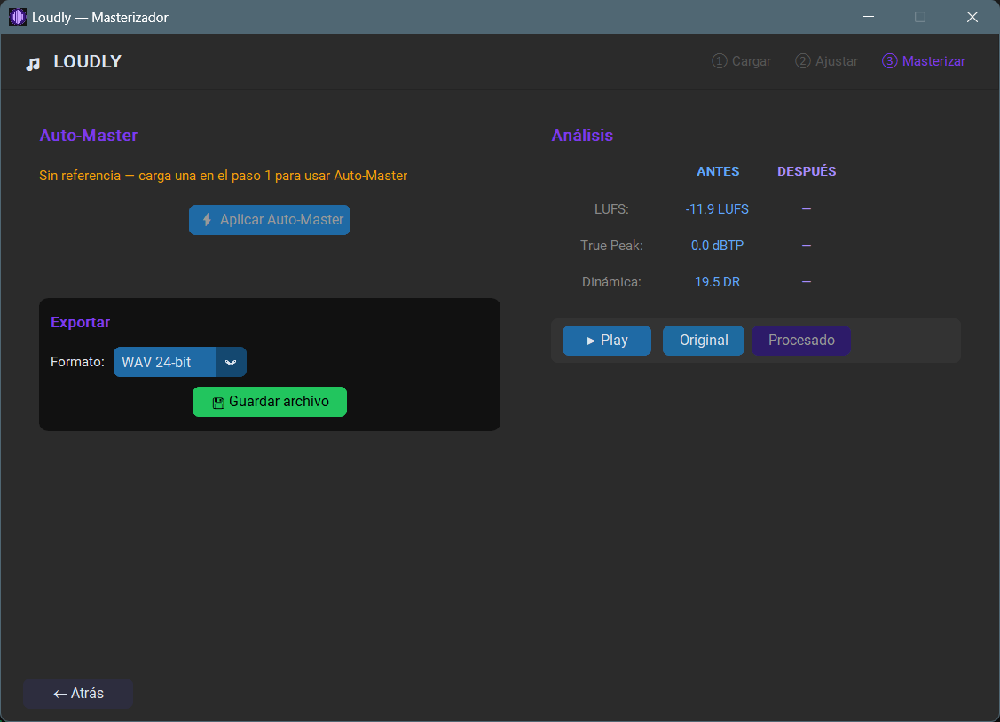
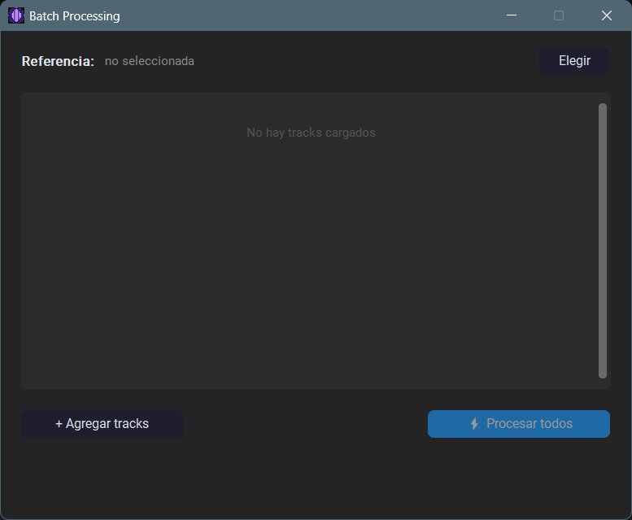

# Loudly — Masterizador de Audio

<div align="center">

[](https://github.com/avilesxd/loudly/actions/workflows/ci.yml)
[](https://github.com/avilesxd/loudly/actions/workflows/release.yml)
[](https://github.com/avilesxd/loudly/releases/latest)
[](https://github.com/avilesxd/loudly/releases)
[](https://github.com/avilesxd/loudly/blob/main/LICENSE)
[](https://www.python.org/downloads/)

Aplicación de escritorio para masterizar temas musicales. Wizard de 3 pasos: cargá tu track, ajustá EQ y loudness, y aplicá auto-masterización por referencia.

<a href="https://github.com/avilesxd/loudly/releases/latest">
  
</a>

</div>

> [!WARNING]
> Al ejecutar `Loudly.exe` por primera vez, Windows puede mostrar el mensaje **"Windows protegió tu PC"** porque el ejecutable no tiene firma de código comercial. El archivo es seguro — podés verificar el código fuente en este repositorio.
>
> **Pasos para ejecutarlo:**
> 1. Hacé clic en **"Más información"**
> 2. Luego en **"Ejecutar de todas formas"**
>
> | Paso 1 — Clic en "Más información" | Paso 2 — Clic en "Ejecutar de todas formas" |
> | :---------------------------------: | :------------------------------------------: |
> |  |  |

---

<div align="center">

| 📂 Paso 1 — Cargar track | 🎚️ Paso 2 — EQ y Limitador | ⚡ Paso 3 — Auto-Master | 🗂️ Batch Processing |
| :-----------------------: | :-------------------------: | :---------------------: | :------------------: |
|  |  |  |  |

</div>

## Características

- **EQ de 4 bandas** — Low (80 Hz), Low-Mid (250 Hz), Hi-Mid (2.5 kHz), High (8 kHz)
- **Limitador con control LUFS** — normaliza a estándares de streaming (Spotify −14, YouTube −13, CD −9)
- **Auto-Master por referencia** — iguala automáticamente el EQ, loudness y dinámica de un track de referencia usando [matchering](https://github.com/sergree/matchering)
- **Procesamiento batch** — auto-masteriza múltiples tracks contra una referencia y los exporta automáticamente como `<nombre>_remastered.wav`
- **Reproductor con toggle Antes/Después** — escuchá la diferencia en tiempo real
- **Análisis comparativo** — muestra LUFS, True Peak y Dinámica antes y después del procesado
- **Exporta a WAV 24-bit o FLAC**

## Formatos soportados

| Entrada               | Salida            |
| --------------------- | ----------------- |
| WAV, MP3, FLAC, AIFF  | WAV 24-bit, FLAC  |

## Instalación (uso)

Descargá el instalador desde [Releases](https://github.com/avilesxd/loudly/releases/latest).
No requiere Python instalado — es un ejecutable standalone para Windows.

## Instalación (desarrollo)

Requiere Python 3.13.

```bash
git clone https://github.com/avilesxd/loudly.git
cd loudly
python -m venv .venv
.venv\Scripts\pip install -r requirements.txt
.venv\Scripts\python main.py
```

## Compilar a .exe

```bash
.venv\Scripts\pyinstaller loudly.spec --clean
```

El ejecutable queda en `dist\Loudly.exe`.

## Tests

```bash
.venv\Scripts\pytest tests/ -v
```

## Arquitectura

```
loudly/
├── main.py              # Punto de entrada
├── app.py               # LoudlyApp — ventana principal, sesión compartida
├── audio/
│   ├── loader.py        # Carga WAV/MP3/FLAC/AIFF → (channels, samples) float32
│   ├── eq.py            # EQ de 4 bandas con pedalboard
│   ├── limiter.py       # Normalización LUFS + true-peak limiter
│   └── automaster.py    # Auto-masterización con matchering
└── ui/
    ├── batch_window.py      # Ventana de procesamiento batch (CTkToplevel)
    ├── steps/
    │   ├── step1_load.py    # Paso 1: carga de archivos
    │   ├── step2_edit.py    # Paso 2: EQ + limiter interactivos
    │   └── step3_master.py  # Paso 3: auto-master + análisis + exportar
    └── components/
        ├── player.py        # Reproductor ANTES/DESPUÉS
        └── waveform.py      # Visualización de forma de onda
```

El estado de la sesión se mantiene en un diccionario `session` en `LoudlyApp` y se comparte por referencia con los tres pasos. Las operaciones de audio se ejecutan en hilos daemon para no bloquear la UI.

### Convención de datos de audio

Todos los arrays internos son `(channels, samples)` en `float32`. Las bibliotecas externas (soundfile, pyloudnorm) usan `(samples, channels)` y se transponen en los puntos de integración.

## Stack

- **UI**: CustomTkinter
- **EQ / Limiter**: [pedalboard](https://github.com/spotify/pedalboard) (Spotify)
- **Auto-Master**: [matchering](https://github.com/sergree/matchering)
- **LUFS**: pyloudnorm
- **Playback**: sounddevice
- **Waveform**: matplotlib (backend TkAgg)
- **MP3**: miniaudio
- **Build**: PyInstaller

## Documentación adicional

- [Guía de usuario](docs/user-guide.md) — cómo usar la aplicación paso a paso
- [Arquitectura](docs/architecture.md) — detalles técnicos del diseño

## Contribuir

¡Las contribuciones son bienvenidas! Leé la [guía de contribución](.github/CONTRIBUTING.md) para empezar.

Si encontrás un bug o tenés una idea, abrí un [issue](https://github.com/avilesxd/loudly/issues/new/choose).

## Licencia

Distribuido bajo la licencia MIT. Ver [LICENSE](LICENSE) para más información.

---

<div align="center">

_Hecho con ❤️ por [Ignacio Avilés](www.linkedin.com/in/ignacioavilescardenasso)_

</div>
